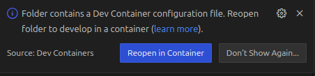

#   GeoScenario Server

Includes: GeoScenario Parser, Checker, Sim Vehicle Planner with Behavior Trees and Maneuver Models.

## Dependencies

- Ubuntu 20.04

### Apt packages

- python3.8
- python3.8-dev
- python3-tk
- python3-pip
- python3-pil
- python3-pil.imagetk

### Python packages

- numpy
- glog
- matplotlib
- scipy
- [py_trees](https://github.com/splintered-reality/py_trees)
- tk
- sysv-ipc
- antlr4-python3-runtime==4.9.3 (later versions cause a parsing error `Exception: Could not deserialize ATN with version (expected 4).`)
- antlr-denter

To automatically install the dependencies, execute

```
bash scripts/install_dependencies.bash
```

## Running

- run `python3.8 GSServer.py -s scenarios/<geoscenario_file>` to start the Server.

```
optional arguments:
  -h, --help            show this help message and exit
  -s [FILE [FILE ...]], --scenario [FILE [FILE ...]]
                        GeoScenario file. If no file is provided, the GSServer will load a scenario from code
  -q VERBOSE, --quiet VERBOSE
                        don't print messages to stdout
  -m, --map-path
                        Set the prefix to append to the value of the attribute `globalconfig->lanelet`
                        e.g. --map-path $HOME/wise-sim-test-suite/maps
  -b, --btree-locations
                        Add higher priority locations to search for btrees by agent btypes
                        e.g. --btree-locations $HOME/wise-sim-test-suite/btrees
  --verify_map          Lanelet map file
```

- GeoScenario files (2.0 required) must be placed inside *scenarios/*
- If a file is not given, you must provide a manual problem startup from code.
- LaneletMap files must be placed inside *scenarios/maps* (a map file is mandatory).
- Co-Simulator ([WISE Sim](https://uwaterloo.ca/waterloo-intelligent-systems-engineering-lab/projects/wise-sim),  [Carla](https://carla.org/), or other) is optional.

## Loading multiple scenario files

- The `--scenario` option can take more than one `.osm` file as its arguments
- For example,
```
python3.8 GSServer.py --scenario scenarios/test_scenarios/gs_straight_obstacles.osm scenarios/test_scenarios/gs_straight_pedestrian.osm
```
- With the exception of `globalconfig` and `origin`, the elements from each scenario are loaded and combined at runtime
- The `globalconfig` and `origin` are used from the first `.osm` file that is specified (which is `gs_straight_obstacles.osm` in the example)
- Multiple scenarios can define vehicles and pedestrians with the same `vid`s and `pid`s
- If these scenarios are passed to the `--scenario` option, then an error will be reported
- All `vid` and `pid` conflicts must be resolved before running `GSServer.py`
- Scenarios can contain vehicles with no `vid` and pedestrians with no `pid`
- These vehicles and pedestrians will be auto-assigned `vid`s and `pid`s
- Auto-assigned `vid`s and `pids` will start from 1 and won't conflict with the other `vid`s and `pid`s

## Configuration:

- Check *SimConfig.py* for configuration options.
- Adjust FRAME_RATE based on hardware performance to avoid drift (Recommended 30Hz).
- Adjust PLANNER_RATE based on hardware performance and what scenario requirements.
- Use SHOW_DASHBOARD = True for GUI. Adjust dashboard refresh rate according to performance.
- Simulations can only run in Real Time (so far).

## Co-Simulation:

- Use the shared memory keys inside SimConfig to read/write the server shared memory blocks.
- We provide a GeoScenario Client for Unreal in */unreal*.

## Documentation:

https://geoscenario2.readthedocs.io/

## Demo
GeoScenario Server running in High Fidelity Simulation with UE5 and Carla

[Youtube Video](https://youtu.be/Fk890JvgwWk?feature=shared)

## Questions?
rqueiroz@uwaterloo.ca

# Using a .devcontainer

GeoScenario server can be used and developed on Linux, Windows, and MacOS with Visual Studio Code and Docker via the Dev Container.

1. Clone the repository and open in VS Code
2. Click on "Reopen in Container" button as shown in the screenshot below (alternatively, execute the command "Dev Containers: Reopen in Container" from command palette):

3. After the docker image is built and the dev container is started, open a new terminal ("Terminal: Create New Terminal" from command palette) and execute `./GSServer.py --help`.

# Contributors

1. Rodrigo Queiroz rqueiroz@uwaterloo.ca
2. Scott Larter scott.larter@uwaterloo.ca
3. Divit Sharma d43sharm@uwaterloo.ca
4. Michał Antkiewicz michal.antkiewicz@uwaterloo.ca